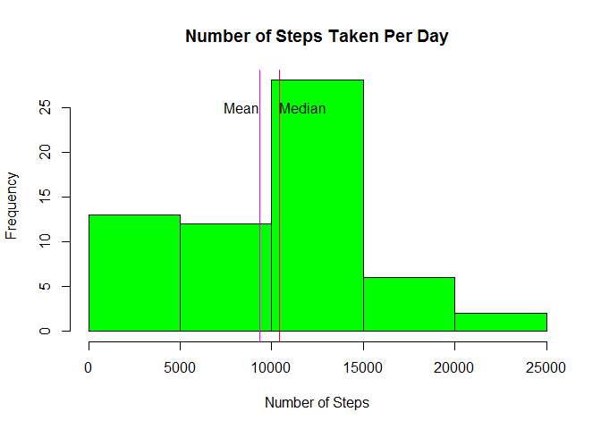
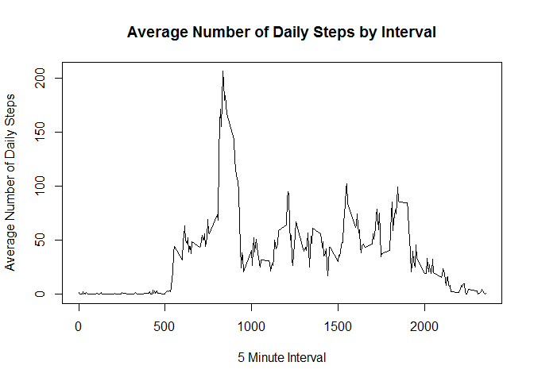
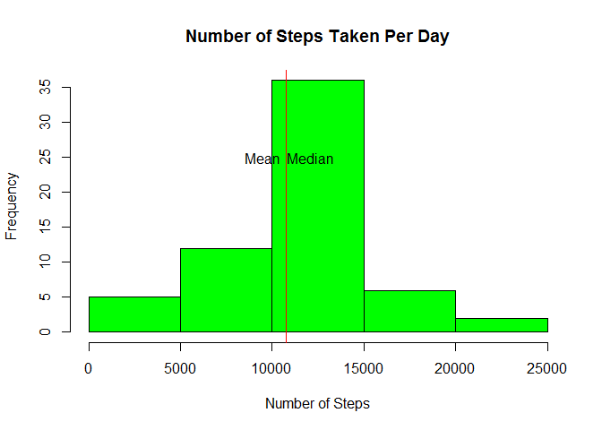
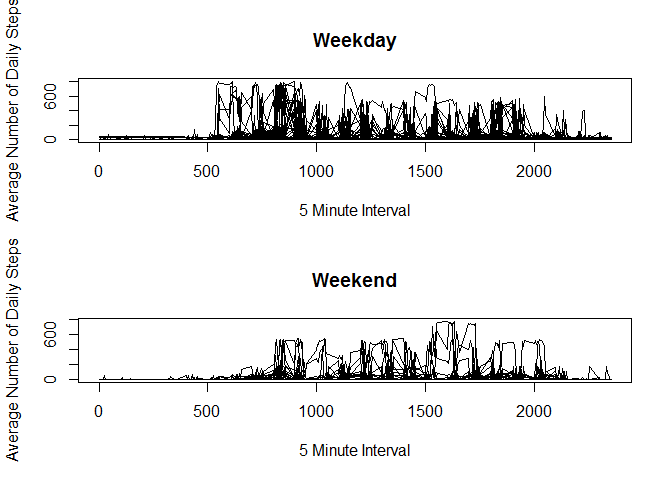

# Reproducible Research: Peer Assessment 1


## Loading and preprocessing the data


```r
## read in csv file

activity <- read.csv("activity.csv", stringsAsFactors = FALSE)

## convert date field to date format

## create a new variable containing the name of the day for each date
```

## What is mean total number of steps taken per day?


```r
## calculate the total number of steps per day

dailysteps <- tapply(activity$steps, activity$date, sum, na.rm = TRUE)
```


```r
## plot histogram

hist(dailysteps, xlab = "Number of Steps", ylab = "Frequency", main = "Number of Steps Taken Per Day", col = "green")
abline(v = mean(dailysteps), col = "magenta") ## mean line
abline(v = median(dailysteps), col = "red") ## median line
text(mean(dailysteps)-1000, 25, "Mean", col = "black") ## mean text
text(median(dailysteps)+1300, 25, "Median", col = "black") ## median text
```




```r
summary(dailysteps)
```

```
##    Min. 1st Qu.  Median    Mean 3rd Qu.    Max. 
##       0    6778   10400    9354   12810   21190
```

The mean number of steps taken per day is `mean(dailysteps)` and the median is `median(dailysteps)`. 

## What is the average daily activity pattern?


```r
## calculate mean for each interval subset

avgsteps <- aggregate(steps ~ interval, activity, mean, na.rm = TRUE)
```


```r
## plot line graph

with(avgsteps, plot(interval, steps, type = "l", xlab = "5 Minute Interval", ylab = "Average Number of Daily Steps", main = "Average Number of Daily Steps by Interval"))
```




```r
## find the interval which has the maximum number of steps

avgsteps[which.max(avgsteps$steps),]
```

```
##     interval    steps
## 104      835 206.1698
```


## Imputing missing values


```r
## Calculate the number of rows with NA's
sum(is.na(activity))
```

```
## [1] 2304
```

The total number of missing rows is `{r}sum(is.na(activity))'.


```r
##replace missing values with the mean for the corresponding 5 minute interval

activityimpute <- activity ##create a new df for imputed data
```


```r
## for each row that contains an NA replace it with the corresponding interval mean

for (i in 1:nrow(activityimpute)) {
        if (is.na(activityimpute$steps[i])) {
        interval <- activityimpute$interval[i]
        steps <- avgsteps[
        avgsteps$interval == interval,]
        activityimpute$steps[i] <- steps$steps
  }
}
```


```r
## calculate the total number of steps per day

dailystepsimpute <- tapply(activityimpute$steps, activityimpute$date, sum, na.rm = TRUE)

## plot histogram

hist(dailystepsimpute, xlab = "Number of Steps", ylab = "Frequency", main = "Number of Steps Taken Per Day", col = "green")
abline(v = mean(dailystepsimpute), col = "magenta") ## mean line
abline(v = median(dailystepsimpute), col = "red") ## median line
text(mean(dailystepsimpute)-1300, 25, "Mean", col = "black") ## mean text
text(median(dailystepsimpute)+1300, 25, "Median", col = "black") ## median text
```




```r
summary(dailystepsimpute)
```

```
##    Min. 1st Qu.  Median    Mean 3rd Qu.    Max. 
##      41    9819   10770   10770   12810   21190
```

The mean number of steps taken per day is $mean(dailystepsimpute)$ and the median is $median(dailystepsimpute)$. In this case the mean and the median are the same.

## Are there differences in activity patterns between weekdays and weekends?


```r
## Create variables to define weekends vs. weekdays

activityimpute$day <- weekdays(as.Date(activityimpute$date))
activityimpute$day[activityimpute$day  %in% c('Saturday','Sunday') ] <- "weekend"
activityimpute$day[activityimpute$day != "weekend"] <- "weekday"

## Create line plot to compare weekends vs. weekdays

avgstepsimpute <- aggregate(steps ~ interval + day, activityimpute, mean, na.rm = TRUE) ## re-use earlier average calculation

## plot line graphs

##subset data by weekend/weekday

aiweekday <-  subset(activityimpute, day == "weekday")
aiweekend <-  subset(activityimpute, day == "weekend")

## set dimension to 1x1 then plot

par(mfrow = c(2,1))
plot(aiweekday$interval, aiweekday$steps, type = "l", xlab = "5 Minute Interval", ylab = "Average Number of Daily Steps", main = "Weekday")
plot(aiweekend$interval, aiweekend$steps, type = "l", xlab = "5 Minute Interval", ylab = "Average Number of Daily Steps", main = "Weekend")
```



